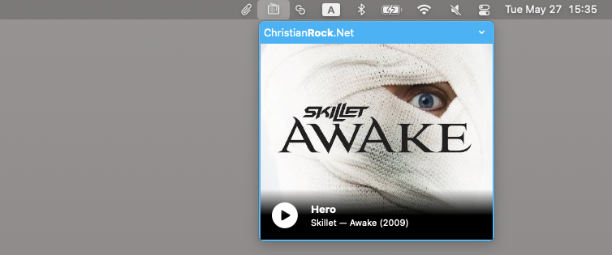

# ChristianRock.Net radio macOS app

CRN is an _unofficial_ lightweight macOS app designed to stream [ChristianRock.Net](https://christianrock.net/) radio stations.
The app is very simple, residing conveniently in your status bar for easy access to your favorite christian radio stations.

## Installation

1. Download the latest release `.zip` archive from the [Releases](https://github.com/avdyushin/CRN/releases) page.
1. Once downloaded, double-click the `.zip` file to extract the app.
1. Drag and drop the extracted app into your `Applications` folder.
1. If prompted, go to `System Preferences > Security & Privacy > General` and click "Open Anyway" to allow the app to run.
